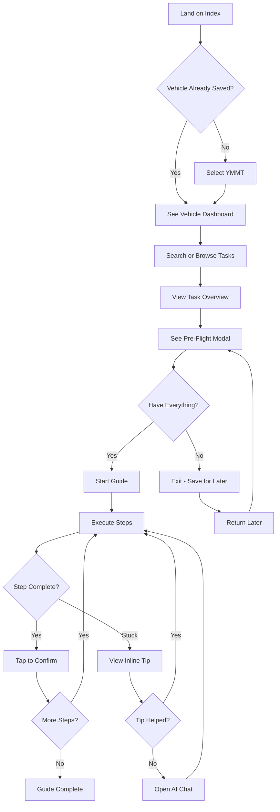
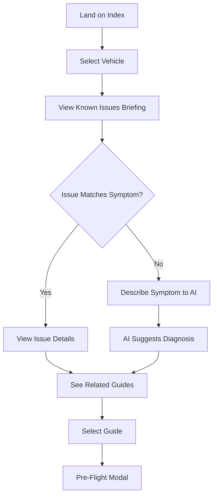
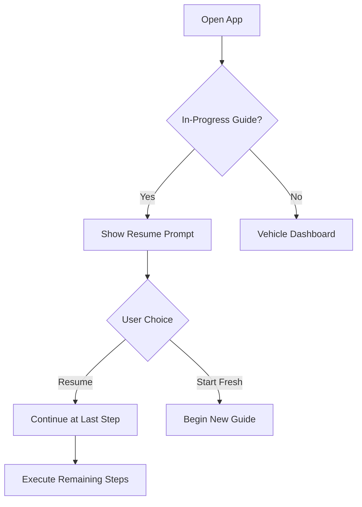

# UX Design Specification - Au7o

**Author:** Devon
**Date:** 2026-02-08

---

## Executive Summary

### Project Vision

Au7o is an offline-first PWA delivering AI-powered automotive maintenance guides for DIY car owners. The application combines expert-level automotive knowledge with a garage-optimized interface, enabling users to diagnose issues, execute repairs, and discover known problems with their specific vehicle—all without requiring constant internet connectivity.

**Core Value Proposition:** Expert guidance in your garage, when you need it, whether online or off.

### Target Users

**Primary Personas:**

1. **The Uncertain Diagnoser** - Vehicle owners facing symptoms they don't understand (check engine lights, unusual sounds, performance issues). They need diagnostic confidence before committing to repairs.

2. **The Inexperienced Owner** - First-time DIYers who want to save money but lack confidence. They need hand-holding, clear safety guidance, and the ability to back out gracefully if under-prepared.

3. **The Mid-Task Stuck User** - Experienced DIYers who hit unexpected complications (seized bolts, missing tools, unclear instructions). They need contextual help without leaving the garage.

**User Context:**
- Using phones in garages with dirty hands and gloves
- Low-light conditions, phone often on workbench at arm's length
- Intermittent or no internet connectivity
- Time-pressured (car is already taken apart)
- Emotionally invested (their vehicle, their money)

### Key Design Challenges

1. **Two-Phase Experience Design** - Creating a distinct yet cohesive visual language for calm discovery (vehicle selection, symptom input) versus focused execution (step-by-step guides in garage conditions)

2. **Garage Environment Constraints** - Designing for 44×44px touch targets with gloves, 18px+ text readable at arm's length, high contrast visible at 30% brightness, one-handed thumb-zone operation

3. **Information Architecture Complexity** - Balancing upfront disclosure (Pre-Flight Modal), proactive warnings (Known Issues), contextual help (inline tips), and AI assistance without creating cognitive overload

4. **Trust Through Transparency** - Building confidence in AI-generated content through visible human approval badges, source citations, and clear confidence indicators

5. **Balancing Delight with Garage Practicality** - Micro-interactions must enhance experience without slowing down users with dirty hands. Dopamine loops should feel earned and purposeful, not gratuitous

### Design Opportunities

1. **Signature Phase Transition** - The shift from Discovery to Execution phase can be a distinctive, memorable UX moment that communicates "now we're getting serious"

2. **Garage-First Excellence** - While competitors design for desktop research, Au7o can own the "phone on workbench" experience with purpose-built interactions

3. **Confidence-Building Patterns** - Pre-Flight Modal, visible progress, and inline tips create psychological safety for anxious first-timers

4. **Premium Aesthetic Foundation** - Drawing from huly.io's clean lines, reflect.app's polish, and Vercel's showcase quality

5. **Dopamine-Driven Micro-Interactions** - Leveraging behavioral psychology through satisfying feedback loops that reinforce user actions and create engagement

### Micro-Interaction Philosophy

**Atmospheric Integration:**
Micro-interactions don't exist in isolation—they build into a living, breathing background atmosphere. Soft, subtle tones and gentle gradients create a cohesive visual layer where interactions feel like natural extensions of the environment rather than decorative overlays.

**Background as Canvas:**
- Soft gradient shifts respond to user progress and state changes
- Subtle color temperature variations reinforce phase context
- Gentle ambient motion creates sense of life without distraction
- Discovery phase: Warm, inviting gradients that breathe slowly
- Execution phase: Focused, minimal gradients that stay out of the way

---

## Core User Experience

### Defining Experience

**Primary Interaction Loop:**
The core of Au7o is the guide execution flow—a satisfying cycle of reading a step, performing the action, and tapping to confirm completion. This loop repeats dozens of times per repair session, and each completion must deliver a small dopamine reward that reinforces progress.

**The Essential Moment:**
The step completion tap is the atomic unit of Au7o's user experience. Every design decision flows from making this interaction instant, satisfying, and reliable. When this feels right, the product feels right.

**Safety Net Design:**
Accidental taps happen—especially with dirty hands. A 3-second undo toast provides graceful recovery without anxiety. The undo feels supportive, not punitive.

**The Calm Companion:**
The interface should feel like a calm, competent mechanic standing beside you—not a manual demanding attention. Users in garages carry ambient stress (car on jack stands, time pressure, physical discomfort). The UI reduces cognitive load rather than adding to it.

**The Identity Shift:**
Au7o isn't just helping users complete tasks—it's helping them become someone new. Every completed guide is a step in the user's journey from "person with car problems" to "person who handles their own car."

**Experience Flow:**
1. **Discovery Phase:** Captivating index → calm vehicle selection → symptom chat or task search → Known Issues briefing
2. **Transition Moment:** Pre-Flight Modal (the trust-building hero moment) → "breath" transition → commitment OR supportive exit
3. **Execution Phase:** High-contrast step-by-step guide → subtle, reliable completion feedback

### Visual Identity

**Signature Design Language:**
Au7o has a recognizable visual thread that connects Discovery calm to Execution focus. This isn't just "two different color schemes" - it's one cohesive identity expressed in two modes.

**The Signature Motif - Gradient Thread:**
A subtle gradient appears across both phases, adapted to context:
- **Discovery:** Soft blue gradient, slowly breathing, inviting
- **Execution:** Minimal gradient accent on progress bar, focused

This gradient is Au7o's visual signature - the element that makes it instantly recognizable.

**Typography Hierarchy:**
- Headlines: Oversized, generous letter-spacing (huly.io influence)
- Body: Clean, readable, sufficient contrast
- Guide steps: Large (18px+), high contrast, scannable

**Discovery Phase - Light Mode:**
```
Background: #EBF4FF (soft blue-white)
Text: #1E3A5F (dark blue-gray)
Primary: #3B82F6 (blue-500)
Muted: #475569 (slate-600)
Gradient: Blue-50 to Blue-100, breathing animation
```

**Discovery Phase - Dark Mode:**
```
Background: #0F172A (deep navy)
Text: #E2E8F0 (soft white)
Primary: #3B82F6 (blue-500, works on both)
Muted: #94A3B8 (slate-400)
Gradient: Navy to slate, breathing animation

Respects prefers-color-scheme automatically
No manual toggle needed for MVP
```

**Execution Phase (Always High-Contrast):**
```
Background: #000000 (pure black)
Text: #FFFFFF (pure white)
Warning: #FCD34D (amber-300)
Safety: #EF4444 (red-500)
Progress accent: Subtle gradient on progress bar
```

### The Index: First Impression & Captivation

**The 3-Second Test:**
When users land on Au7o, they decide in 3 seconds whether to stay or bounce. The index must immediately communicate: "This is different. This is premium. This understands cars AND design."

**Discovery Phase Aesthetic (Index & Vehicle Selection):**
The index IS Discovery Phase - calm, inviting, premium. Drawing from huly.io's clean motion, reflect.app's elegant gradients, and Vercel's confident messaging.

**Index Design Requirements:**

| Element | Requirement |
|---------|-------------|
| Hero | Bold headline, breathing gradient background (CSS animation), immediate value clarity |
| Value Prop | "Expert guidance in your garage. Online or off." - answered in 2 seconds |
| Vehicle Selector | Above fold, prominent - the product IS the entry point |
| Trust Signals | "Works offline" • "AI-validated guides" • "Free to start" |
| Product Preview | Static screenshot showing Pre-Flight Modal (our differentiator) |
| Atmosphere | Signature gradient that slowly breathes, feels alive without being busy |
| Dark Mode | Automatically adapts to system preference |

**Product Screenshot Specification:**
The index shows a screenshot of the Pre-Flight Modal - our key differentiator. This visual says "we tell you everything before you start" better than any copy.

Screenshot shows:
- Pre-Flight Modal header with vehicle name
- Tools required section (collapsed)
- Parts required section (expanded, showing OEM vs aftermarket)
- Difficulty rating and time estimate
- "I Have Everything, Start" button

**The Narrative Arc of Landing:**

```
HOOK (0-3 seconds):
  Visual impact + clear value proposition
  Breathing gradient, bold typography
  "This is premium. This is for me."

PROOF (3-10 seconds):
  Vehicle selector visible, Pre-Flight screenshot
  Trust signals establish credibility
  "I can see what I'm getting."

ACTION (10+ seconds):
  Select vehicle, begin journey
  Clear path forward
  "I know exactly what to do next."
```

**Index Acceptance Criteria (MVP Done = All Checked):**
- [ ] Hero loads in <3s TTI
- [ ] Gradient animation runs at 60fps (no jank)
- [ ] YMMT selector visible without scrolling (mobile 375px+)
- [ ] Trust signals visible without scrolling (mobile)
- [ ] Product screenshot visible (can be below fold)
- [ ] Dark mode supported (matches system preference)
- [ ] Lighthouse Performance >90
- [ ] Lighthouse Accessibility >90
- [ ] Bounce rate baseline established for iteration

### The Pre-Flight Modal: Strategic Differentiator

**Why This Matters:**
The Pre-Flight Modal is not just a safety feature—it's the trust-building moment that separates Au7o from every forum post, YouTube video, and competitor app. No one else tells users "Here's what you need, here's what might go wrong with YOUR specific car, and here's a graceful way out if you're not ready."

**Competitive Moat:**
- YouTube videos can be downloaded for offline (matches our offline capability)
- Forums have checklists (matches our format)
- But NO ONE provides vehicle-specific Pre-Flight disclosure with Known Issues

**Marketing Hero Moment:**
"Before you start, we tell you everything." This is Au7o's Blue Ocean positioning.

### The Phase Transition: "The Breath"

**Why This Matters:**
The moment when Discovery becomes Execution should feel intentional and notable - like a movie scene change. Not jarring, but meaningful. This subtle effect signals "OK, now we're serious."

**The Breath Effect:**
```css
.phase-transition {
  animation: phase-breath 400ms ease-in-out;
}

@keyframes phase-breath {
  0% { opacity: 1; transform: scale(1); }
  50% { opacity: 0.85; transform: scale(0.995); }
  100% { opacity: 1; transform: scale(1); }
}
```

**What Users Experience:**
- Screen dims very slightly (barely perceptible)
- Subtle scale creates feeling of "taking a breath"
- Colors shift from Discovery to Execution
- Total duration: 400ms
- User feels: "The app is ready. I'm ready."

**Phase 2 Deferred:**
- Vehicle silhouettes/badges on selection (requires SVG assets per make)
- Vehicle-personality UI adaptation (requires data model work)

### Platform Strategy

**Primary: Mobile PWA (Garage Use)**
- Touch-first, one-handed thumb operation
- Offline-first with atomic Service Worker caching
- 44×44px touch targets for gloved/dirty hands
- High contrast for low-light garage visibility
- Bottom-anchored actions in thumb zone
- Haptic feedback as optional enhancement (not all PWA contexts support it)
- No audio feedback (garage noise makes sound pointless)

**Secondary: Desktop Browser (Research Use)**
- Responsive design scaling from mobile
- Keyboard navigation support
- Full-width Pre-Flight Modal for planning
- Discovery phase optimized for browsing

**PWA Requirements:**
- Safari iOS: Explicit "Add to Home Screen" onboarding flow
- Chrome Android: Native install prompt
- Cache status badge: User-visible offline readiness
- Graceful degradation: AI features offline → inline tips remain

**Technical Optimizations:**
- First-time guide load: Skeleton UI with progress indicator (<5s to first step)
- Progress persistence: Debounced saves (500ms) for performance during rapid taps
- Perceived instant (<100ms), technically optimized for device constraints

### Effortless Interactions

**Zero-Friction Design Goals:**

| Interaction | Effortless Standard |
|-------------|---------------------|
| Index to vehicle selection | Immediate - selector is above fold |
| Step navigation | Single thumb tap, perceived instant (<100ms) |
| Accidental tap recovery | 3-second undo toast, graceful and supportive |
| Progress persistence | Debounced auto-save, survives browser close, device restart, offline |
| Phase transition | "Breath" effect (400ms), zero layout shift |
| Getting help | Inline tip visible immediately, AI chat one tap away |
| Knowing what you need | Pre-Flight Modal shows everything before starting |
| Deciding "not yet" | Cancel feels supportive, not like failure |
| Offline confidence | Clear "✓ Cached" badge, no anxiety about connectivity |

**Friction Eliminated (vs. Competitors):**
- No account required (localStorage-first)
- No mid-repair parts research (Pre-Flight handles upfront)
- No wall-of-text scrolling (checklist + expandable tips)
- No "am I ready?" uncertainty (Pre-Flight answers definitively)
- No progress loss (debounced auto-save on every action)
- No accidental completion anxiety (undo safety net)

### Critical Success Moments

**First Value Moment:**
When the user completes their first guide step and sees the clean checkmark transition—they realize this is more organized than forum posts and YouTube comments.

**Confidence Milestones:**
1. Index landing: "This looks premium and trustworthy"
2. Vehicle selected: "It knows my exact car"
3. Pre-Flight Modal approval: "I have everything I need"
4. Pre-Flight Modal exit: "I'll come back when ready" (equally valid outcome)
5. Progress indicator: Always visible, shows exactly where they are
6. Guide completion: Clean, satisfying end state

**Make-or-Break Flows with Measurable Success Metrics:**

| Critical Flow | Success Metric (Observable) |
|--------------|----------------|
| Index load | <3s TTI, bounce rate <50% |
| First guide generation | <5s to first step visible, 0 errors on happy path |
| Getting stuck | 80% of users who open inline tip do NOT tap "Ask AI" within 60s |
| Phase transition | <400ms with "breath" effect, 0 layout shift (Lighthouse CLS) |
| Error recovery | 95% of retry taps result in successful action within 10s |
| Accidental completion | 100% recoverable via undo within 3 seconds |

**Inline Tip Coverage Validation:**
Target 90% coverage of common stuck points. Validate through adversarial testing—deliberately attempt to get stuck in ways not covered by tips. Document edge cases and iterate.

### Celebration Philosophy: Subtle by Default

**MVP Approach:**
A fast, reliable checkmark beats a fancy, buggy celebration every time. We default to subtle feedback that works for everyone—experienced Marcus and nervous Sarah alike. No user should ever feel patronized or interrupted.

**Celebration Principle:**
> "Default to subtle. Let user behavior tell us if more is needed."

**MVP Celebrations (Ship This):**

| Moment | Feedback |
|--------|----------|
| Step completion | Checkmark transition (150ms), optional haptic |
| Guide completion | "Complete" badge, subtle background pulse |
| Progress | Always-visible indicator showing step X of Y |

**Phase 2 Considerations (If User Feedback Supports):**
- Celebration preferences toggle (more/less encouragement)
- Competence-aware fading (warmer for first-timers, subtle for veterans)
- Milestone acknowledgments (first oil change, etc.)
- Comeback recognition (completing after getting stuck)

### Animation Specifications (MVP)

Minimal, reliable, consistent:

**Index Hero (Discovery Phase):**
```css
Background gradient animation:
  - Subtle color shift over 8-10 seconds
  - GPU-accelerated (transform/opacity only)
  - Feels alive without being distracting
  - Works in both light and dark mode
```

**Step Completion:**
```
Checkmark: CSS transition, 150ms ease-out
Transform: scale(0.8) → scale(1)
Haptic: navigator.vibrate(10) if available
No background effects
```

**Guide Completion:**
```
Badge: fade-in, 200ms ease-out
Background: optional subtle pulse, 200ms
No confetti, no elaborate animations
```

**Phase Transition - "The Breath":**
```css
Duration: 400ms ease-in-out
Opacity: 1 → 0.85 → 1
Scale: 1 → 0.995 → 1
Background: Cross-fade between phase colors
No layout shift: All elements maintain position
```

### Experience Principles

**Principle 1: Captivate, Then Guide**
The index captivates with premium design. The guide delivers with reliable execution. First impressions matter—users must feel "this is different" within 3 seconds.

**Principle 2: Every Tap Matters**
The step completion tap is our atomic unit of value. It must be instant, satisfying, and reliable. Design decisions that compromise this interaction are rejected.

**Principle 3: Garage-First, Always**
Every feature is designed for someone with dirty hands, poor lighting, and their car taken apart. Desktop research is nice to have; garage execution is essential.

**Principle 4: Confidence Before Action**
Users never wonder if they're ready. Pre-Flight Modal, Known Issues briefing, and inline tips ensure users feel prepared before and supported during every step.

**Principle 5: Saying "Not Yet" Is Success**
The Pre-Flight Modal cancel is a feature, not a failure. Sending unprepared users into repairs creates churn and frustration. Celebrating preparedness—including the decision to wait—builds trust and retention.

**Principle 6: Subtle Delight, Never Patronizing**
Feedback is immediate but never over-the-top. Experienced users get efficiency; new users get reassurance. No one feels talked down to. A clean checkmark respects everyone.

**Principle 7: Graceful Degradation**
When connectivity fails, core functionality continues. When AI is unavailable, inline tips provide the answer. When uncertainty exists, the UI provides clarity. When mistakes happen, undo provides recovery.

**Principle 8: Perceived Instant, Technically Optimized**
Users experience instant response. Behind the scenes, we debounce saves, lazy-load images, and optimize for device constraints. The magic is invisible.

**Principle 9: Reduce Ambient Anxiety**
Users in garages carry background stress—car on jack stands, time pressure, physical discomfort. The interface actively reduces cognitive load rather than adding to it. We are the calm companion, not another demanding screen.

**Principle 10: Ship Simple, Enhance with Data**
MVP ships with subtle, reliable interactions. Richer features are Phase 2, driven by actual user feedback, not assumptions.

### Implementation Heuristics

When making design or development decisions, apply this three-question litmus test:

1. **Does it feel instant?** - If there's perceptible lag, it's wrong.
2. **Does it work offline?** - If it requires connectivity for core function, reconsider.
3. **Can they recover from mistakes?** - If an error is unrecoverable, add a safety net.

If the answer to any question is "no," the implementation needs revision before shipping.

---

## Desired Emotional Response

### Primary Emotional Goals

**Core Feeling: Competent and Supported**
Users should feel like they have an expert mechanic standing beside them who genuinely believes in their ability to succeed. Not talked down to. Not abandoned. Supported.

**The Word-of-Mouth Feeling:**
"This app actually made me feel like I could do it."

**Post-Completion Feeling:**
Pride + Relief → "I did that. And it wasn't as scary as I thought."

**Competitive Differentiation:**
- Forums make users feel: Overwhelmed
- YouTube makes users feel: Passive
- Generic apps make users feel: Uncertain
- **Au7o makes users feel: Prepared and Capable**

### Emotional Journey Mapping

| Stage | Target Emotion | Design Mechanism |
|-------|---------------|------------------|
| Index Landing | Intrigued, Trusting | Premium aesthetic, breathing gradient, clear value |
| Vehicle Selection | Recognized, Personal | "It knows MY car" - specific YMMT |
| Known Issues Briefing | Informed, Not Scared | Transparency framed as helpful, not alarming |
| Pre-Flight Modal | Confident or Appropriately Cautious | Full disclosure enables informed decision |
| Phase Transition | Focused, Ready | "The Breath" signals shift to serious mode |
| Guide Execution | Capable, In Control | Clean steps, visible progress, one-tap navigation |
| Getting Stuck | Supported, Not Alone | Inline tip immediately visible, AI backup available |
| Guide Completion | Proud, Accomplished | Subtle confirmation, identity reinforcement |
| Error States | Encouraged, Not Blamed | Supportive messaging, easy recovery |
| Returning | Welcomed, Continuous | Progress remembered, seamless resume |

### Micro-Emotions by Phase

**Discovery Phase Emotions:**
- Confidence over Confusion
- Trust over Skepticism
- Curiosity over Overwhelm
- Invitation over Intimidation

**Transition Phase Emotions:**
- Preparedness over Anxiety
- Control over Pressure
- Anticipation over Dread
- Permission over Obligation

**Execution Phase Emotions:**
- Competence over Frustration
- Focus over Distraction
- Support over Isolation
- Progress over Stagnation

**Completion Emotions:**
- Accomplishment over Relief
- Growth over Stasis
- Satisfaction over Emptiness
- Pride over Just-finished

### Emotions to Actively Avoid

| Emotion | Common Cause | Au7o Prevention |
|---------|--------------|-----------------|
| Overwhelmed | Information overload | Progressive disclosure, collapsible sections |
| Patronized | Excessive hand-holding | Subtle feedback, respect competence |
| Abandoned | No help when stuck | 90% tip coverage, AI fallback |
| Anxious | Uncertainty | Pre-Flight answers "am I ready?" |
| Frustrated | Lost progress, lag | Auto-save, instant response |
| Blamed | Accusatory error messages | Supportive tone, recovery paths |
| Rushed | Time pressure | User-controlled pace, no timers |

### Emotional Design Principles

**Principle E1: Trust Through Transparency**
Show everything upfront. Users who know what they're getting into feel confident, not trapped. Pre-Flight Modal, Known Issues briefing, and visible progress all build trust.

**Principle E2: Support Without Smothering**
Be there when needed, invisible when not. Inline tips appear at high-risk steps. AI chat is one tap away. But experienced users can fly through without interruption.

**Principle E3: Celebrate Quietly**
Mark accomplishments without fanfare. A clean checkmark respects competence more than confetti. Pride comes from the work, not the applause.

**Principle E4: Make "Not Yet" Feel Good**
Canceling the Pre-Flight Modal should feel wise, not weak. "I'll come back prepared" is a success, not a failure. Design celebrates prudent decisions.

**Principle E5: Errors Are Recoverable Moments**
When things go wrong, the UI should feel encouraging: "That's okay, let's try again." Easy recovery, supportive tone, no blame.

**Principle E6: Progress Feels Permanent**
Nothing is lost. Progress auto-saves. Sessions resume exactly where stopped. Users never experience the frustration of lost work.

**Principle E7: Complexity Fades, Competence Grows**
What feels daunting on guide one feels familiar by guide three. The emotional journey isn't just per-session—it's per-user over time. Au7o helps users become someone new.

---

## UX Pattern Analysis & Inspiration

### Inspiring Products Analysis

**huly.io - Living Interface Design**

| Aspect | Pattern | Au7o Application |
|--------|---------|------------------|
| Motion | Breathing gradients, floating elements | Discovery Phase background animation |
| Typography | Oversized headlines, generous letter-spacing | Index hero, section headers |
| Color | Cool blues, warm accents | Discovery Phase palette |
| Depth | Subtle shadows, layered elements | Pre-Flight Modal, card stacking |
| Interaction | Intentional hover states | Button and selector feedback |

**reflect.app - Polished Minimalism**

| Aspect | Pattern | Au7o Application |
|--------|---------|------------------|
| Loading | Skeleton shimmer effects | Guide loading, AI thinking states |
| Focus | Distraction-free work mode | Execution Phase minimal chrome |
| Micro-interactions | Satisfying feedback on every action | Step completion, selections |
| Whitespace | Breathing room as feature | Discovery Phase layouts |
| Transitions | Smooth state changes | Phase transition "breath" |

**Vercel Showcase - Confident Premium**

| Aspect | Pattern | Au7o Application |
|--------|---------|------------------|
| Aesthetic | Dark, confident, premium | Execution Phase styling |
| Messaging | Bold, minimal copy | Index value proposition |
| Proof | Visual product demos | Pre-Flight Modal screenshot |
| Performance | Speed as trust signal | <3s TTI, 60fps animations |
| Typography | Bold, scannable | Guide step instructions |

### Transferable UX Patterns

**Navigation Patterns:**
- **Progressive Disclosure** (all three) → Pre-Flight Modal collapsible sections
- **Clear Visual Hierarchy** (huly.io) → Obvious next steps at every point
- **Minimal Chrome in Focus Mode** (reflect.app) → Execution Phase strips to essentials

**Interaction Patterns:**
- **Breathing Backgrounds** (huly.io) → Discovery Phase ambient life
- **Skeleton Loading** (reflect.app) → Guide generation shimmer states
- **Satisfying Micro-feedback** (reflect.app) → Step completion checkmark
- **Intentional Transitions** (all three) → "The Breath" phase transition

**Visual Patterns:**
- **Gradient as Signature** (huly.io, reflect.app) → Au7o gradient thread across phases
- **Dark Mode Excellence** (Vercel) → Execution Phase high-contrast
- **Typography as Hierarchy** (Vercel, huly.io) → Bold headlines, readable body
- **Whitespace as Feature** (reflect.app) → Discovery Phase breathing room

**Trust Patterns:**
- **Visual Proof** (Vercel) → Pre-Flight Modal screenshot on index
- **Performance as Brand** (Vercel) → Fast load = trustworthy app
- **Subtle Depth** (huly.io) → Layered elements feel solid, not flat

### Anti-Patterns to Avoid

| Anti-Pattern | Why It Fails | Au7o Prevention |
|--------------|--------------|-----------------|
| Gratuitous Animation | Distracts, slows down, feels cheap | Purposeful motion only |
| Flat/Sterile Design | Feels like a template, not premium | Subtle gradients, depth, life |
| Wall of Text | Overwhelms, causes bounces | Progressive disclosure, scannable |
| Dark Mode Only | Excludes users, poor for Discovery | Two-phase approach |
| Generic Loading | Feels broken, not polished | Skeleton shimmer with personality |
| Over-celebration | Patronizing, interrupts flow | Subtle checkmarks, no confetti |
| Hidden Navigation | Users get lost | Always-visible progress indicator |
| Slow Transitions | Feels laggy, not intentional | 150-400ms max, GPU-accelerated |

### Design Inspiration Strategy

**Adopt Directly:**
- Breathing gradient backgrounds (huly.io → Discovery Phase)
- Skeleton shimmer loading (reflect.app → Guide loading)
- Dark high-contrast execution (Vercel → Execution Phase)
- Visual proof on landing (Vercel → Pre-Flight screenshot)
- Bold typography hierarchy (all three → Throughout)

**Adapt for Au7o:**
- **Gradient signature:** Use across BOTH phases, adapted for context (blue for Discovery, minimal accent for Execution)
- **Focus mode:** reflect.app's distraction-free → Execution Phase but with always-visible progress
- **Micro-interactions:** Balance polish with garage practicality (150ms, not 500ms)

**Explicitly Avoid:**
- Complex parallax (slows low-end devices, garage use case)
- Hover-dependent interactions (touch-first for garage)
- Sound effects (garage noise makes them pointless)
- Heavy JS animations (must work offline, fast)
- Decoration for decoration's sake (every element earns its place)

### Inspiration-to-Implementation Mapping

| Inspiration | Pattern | Au7o Implementation |
|-------------|---------|---------------------|
| huly.io gradient | Breathing background | 8-10s CSS animation, Discovery Phase |
| reflect.app skeleton | Loading shimmer | Gradient animation on placeholder cards |
| Vercel dark mode | High-contrast focus | Execution Phase #000/#FFF |
| huly.io typography | Bold headlines | 1.5-2rem hero, generous letter-spacing |
| reflect.app micro-interactions | Satisfying feedback | 150ms scale transition on checkmark |
| Vercel visual proof | Product screenshot | Pre-Flight Modal on index |
| All three: performance | Speed as trust | <3s TTI, 60fps, Lighthouse >90 |

---

## Design System Foundation

### Design System Choice

**Stack: Tailwind CSS + Headless UI + Custom Design Tokens**

This approach provides:
- **Tailwind CSS:** Utility-first styling for rapid iteration and small bundle size
- **Headless UI:** Accessible, unstyled component primitives (dropdowns, modals, transitions)
- **CSS Custom Properties:** Phase-based theming (Discovery/Execution) with semantic tokens
- **Custom Components:** Built on these foundations for Au7o-specific UI

### Rationale for Selection

| Requirement | How This Stack Delivers |
|-------------|------------------------|
| Solo maintainability | Tailwind's utility classes = less custom CSS to maintain |
| AI-maintainable | Claude Code understands Tailwind patterns well |
| Premium aesthetic | Custom tokens + breathing gradients = unique look |
| Accessibility (NFR-A4, A5) | Headless UI handles keyboard nav, ARIA, focus management |
| Performance (<200KB bundle) | Tailwind treeshakes, Headless UI is lightweight |
| Offline-first | No external CSS CDN dependencies |
| Two-Phase theming | CSS custom properties switch entire color systems |

### Implementation Approach

**Layer 1: Design Tokens (CSS Custom Properties)**
```css
/* Already defined in globals.css */
--color-discovery-primary: #3B82F6;
--color-execution-background: #000000;
/* etc. */
```

**Layer 2: Tailwind Configuration**
- Extend Tailwind with custom colors referencing CSS properties
- Define custom spacing, typography scales
- Create utility classes for phase-specific styling

**Layer 3: Component Primitives (Headless UI)**
- Listbox → YMMT Selector (already implemented)
- Dialog → Pre-Flight Modal
- Transition → Phase transitions, "The Breath"
- Disclosure → Collapsible sections

**Layer 4: Custom Components**
- StepCard (guide step with completion state)
- ProgressBar (gradient accent, phase-aware)
- TrustBadge (offline status, human-approved)
- SkeletonLoader (shimmer effect)

### Customization Strategy

**Breathing Gradient Animation:**
```css
@keyframes breathe {
  0%, 100% { background-position: 0% 50%; }
  50% { background-position: 100% 50%; }
}

.breathing-gradient {
  background: linear-gradient(135deg, var(--gradient-start), var(--gradient-end));
  background-size: 200% 200%;
  animation: breathe 8s ease-in-out infinite;
}
```

**Phase Transition:**
```css
.phase-discovery { /* Discovery tokens active */ }
.phase-execution { /* Execution tokens active */ }

.phase-transition {
  animation: phase-breath 400ms ease-in-out;
}
```

**Touch Target Enforcement:**
```css
.touch-target {
  min-width: 44px;
  min-height: 44px;
}
```

### Component Library Structure

```
src/components/
├── ui/                    # Base primitives
│   ├── Button.tsx
│   ├── Card.tsx
│   ├── Modal.tsx
│   └── SkeletonLoader.tsx
├── discovery/             # Discovery phase components
│   ├── YMMTSelector.tsx   # ✅ Already exists
│   ├── KnownIssuesBriefing.tsx
│   └── PreFlightModal.tsx
├── execution/             # Execution phase components
│   ├── StepCard.tsx
│   ├── ProgressBar.tsx
│   ├── InlineTip.tsx
│   └── AIChat.tsx
└── shared/                # Cross-phase components
    ├── Header.tsx
    ├── OfflineBadge.tsx
    └── ErrorState.tsx
```

### Design Token Reference

**Discovery Phase:**

| Token | Light Mode | Dark Mode |
|-------|------------|-----------|
| Background | #EBF4FF | #0F172A |
| Text | #1E3A5F | #E2E8F0 |
| Primary | #3B82F6 | #3B82F6 |
| Muted | #475569 | #94A3B8 |

**Execution Phase:**

| Token | Value |
|-------|-------|
| Background | #000000 |
| Text | #FFFFFF |
| Warning | #FCD34D |
| Safety | #EF4444 |

**Shared Semantics:**

| Token | Value | Usage |
|-------|-------|-------|
| Success | #22C55E | Completion, cache status |
| Error | #EF4444 | Errors, safety warnings |
| Warning | #F59E0B | Caution states |

### Accessibility Built-In

**Headless UI Provides:**
- Keyboard navigation (arrow keys, escape, enter)
- Focus management (trap focus in modals)
- ARIA attributes (roles, states, labels)
- Screen reader announcements

**We Ensure:**
- 44×44px touch targets (NFR-A7)
- AAA contrast for safety callouts (NFR-A2)
- AA contrast minimum for all text (NFR-A3)
- 18px+ text for guide steps (NFR-A8)

---

## Defining Core Experience

### The Atomic Interaction

**Au7o's Defining Experience:**
> "Tap to complete steps with instant, satisfying feedback"

Like Tinder's swipe or Snapchat's disappearing photos, Au7o's core interaction is the step completion tap. This single action—reading a step, performing the work, tapping to confirm—repeats dozens of times per repair session. When this feels right, everything feels right.

**The "Tell a Friend" Description:**
"It's like having a calm mechanic beside you, breaking everything into clear steps. You tap when you're done, and it just... acknowledges you. No fuss. You always know exactly where you are."

### User Mental Model

**How Users Currently Solve This Problem:**
- YouTube: Pause-play-rewind cycle, lose their place, can't mark progress
- Forums: Wall of text, no structure, contradictory advice, never sure if they're ready
- OEM Manuals: Dense, assume expertise, no Known Issues for their specific year
- Memory: Experienced users rely on memory, but forget specifics and torque specs

**Mental Model Users Bring:**
Users expect a checklist, not a wall of text. They want to mark progress, not scroll. They expect the app to know their specific car, not give generic advice.

**Where Users Get Confused/Frustrated:**
- Uncertainty about readiness ("Do I have everything?")
- Lost progress ("Where was I?")
- Getting stuck ("What now?")
- Accidental mistakes ("I didn't mean to tap that")

### Success Criteria

| Criterion | Observable Behavior |
|-----------|---------------------|
| Instant Response | <100ms perceived response on every tap |
| Progress Visible | User can answer "What step am I on?" at a glance |
| Recovery Possible | Accidental tap recovered via 3-second undo toast |
| Offline Reliable | Same experience whether connected or not |
| Help Available | Stuck user finds tip immediately, AI backup if needed |
| Context Preserved | Returning user resumes exactly where they stopped |

### Novel vs Established Patterns

| Pattern Type | Pattern | Innovation Layer |
|--------------|---------|------------------|
| Established | Checklist with completion states | Standard, users expect this |
| Established | Progress indicator | Standard, users expect this |
| Novel | Pre-Flight Modal with full disclosure | No competitor does this |
| Novel | Known Issues briefing (vehicle-specific) | Unique trust builder |
| Novel | Two-Phase Design Language | Discovery calm → Execution focus |
| Novel | "The Breath" phase transition | Distinctive moment, signals mode shift |
| Adapted | Inline tips at high-risk steps | Forum wisdom, structured |
| Adapted | 3-second undo toast | Standard undo, tuned for garage |

### Experience Mechanics

**The Step Completion Loop:**

```
1. INITIATION
   • Step card visible with instruction text
   • Inline tip visible if high-risk step
   • User reads, understands, performs work

2. INTERACTION
   • User taps step card or completion button
   • 44×44px touch target for gloved hands
   • Single tap, no long-press or gestures

3. FEEDBACK (150ms)
   • Checkmark scales in (0.8 → 1.0)
   • Optional haptic (10ms vibration if available)
   • Progress indicator advances
   • Undo toast appears (3-second window)

4. COMPLETION
   • Next step scrolls into view
   • Previous step collapses (optional)
   • Progress debounce-saved to localStorage (500ms)
   • User clearly knows: "That's done. What's next?"
```

**Error Recovery:**

| Error State | User Experience |
|-------------|-----------------|
| Accidental tap | Undo toast visible 3 seconds, tap to reverse |
| Missed step | No forced ordering, user can go back |
| Got stuck | Inline tip visible, AI chat one tap away |
| Lost progress | Never happens—auto-save on every action |
| Offline | Same experience, no difference visible |

---

## Visual Design Foundation

### Color System

**Two-Phase Color Architecture:**
Au7o uses distinct color systems for each phase, unified by a consistent primary blue accent.

**Discovery Phase Palette:**

| Role | Light Mode | Dark Mode | Usage |
|------|------------|-----------|-------|
| Background | #EBF4FF | #0F172A | Page background |
| Surface | #FFFFFF | #1E293B | Cards, modals |
| Text Primary | #1E3A5F | #E2E8F0 | Headlines, body |
| Text Muted | #475569 | #94A3B8 | Secondary text |
| Primary | #3B82F6 | #3B82F6 | Actions, links |
| Gradient Start | #DBEAFE | #1E3A5F | Breathing background |
| Gradient End | #EFF6FF | #0F172A | Breathing background |

**Execution Phase Palette (Always High-Contrast):**

| Role | Value | Usage |
|------|-------|-------|
| Background | #000000 | Page background |
| Surface | #1A1A1A | Cards, step containers |
| Text | #FFFFFF | All text |
| Warning | #FCD34D | Caution callouts |
| Safety | #EF4444 | Critical warnings |
| Success | #22C55E | Completion states |
| Progress Accent | Blue gradient | Progress bar |

**Semantic Colors (Cross-Phase):**

| Semantic | Value | Usage |
|----------|-------|-------|
| Success | #22C55E | Completions, cache ready |
| Error | #EF4444 | Errors, safety callouts |
| Warning | #F59E0B | Caution states |
| Info | #3B82F6 | Informational |

### Typography System

**Type Scale:**

| Level | Size | Weight | Line Height | Usage |
|-------|------|--------|-------------|-------|
| Hero | 2.5rem (40px) | 700 | 1.1 | Index headline |
| H1 | 2rem (32px) | 700 | 1.2 | Page titles |
| H2 | 1.5rem (24px) | 600 | 1.3 | Section headers |
| H3 | 1.25rem (20px) | 600 | 1.4 | Subsections |
| Body | 1rem (16px) | 400 | 1.5 | Standard text |
| Body Large | 1.125rem (18px) | 400 | 1.5 | Guide steps |
| Caption | 0.875rem (14px) | 400 | 1.4 | Secondary info |
| Small | 0.75rem (12px) | 500 | 1.3 | Badges, labels |

**Font Stack:**
```css
--font-sans: system-ui, -apple-system, BlinkMacSystemFont, 'Segoe UI', Roboto, sans-serif;
--font-mono: ui-monospace, 'SF Mono', Monaco, 'Cascadia Mono', monospace;
```

**Typography Principles:**
- Guide step text: Always 18px+ for garage readability
- Headlines: Generous letter-spacing (0.02em) for premium feel
- Line length: 60-75 characters max for comfortable reading
- No justified text—left-aligned for accessibility

### Spacing & Layout Foundation

**Spacing Scale (8px base):**

| Token | Value | Usage |
|-------|-------|-------|
| xs | 4px | Inline padding, icon gaps |
| sm | 8px | Tight element spacing |
| md | 16px | Standard component padding |
| lg | 24px | Section spacing |
| xl | 32px | Major section breaks |
| 2xl | 48px | Page-level spacing |
| 3xl | 64px | Hero section padding |

**Layout Principles:**
- Mobile-first: Design for 375px, scale up
- Touch zones: 44×44px minimum for all interactive elements
- Thumb zone: Critical actions in bottom 40% of screen
- Content width: Max 640px for readability on large screens

**Grid System:**
- Mobile: Single column, full-width cards
- Tablet: Optional 2-column for discovery, single for execution
- Desktop: Centered content with max-width constraint

### Accessibility Foundations

**Contrast Requirements:**

| Context | Minimum Ratio | Target |
|---------|---------------|--------|
| Body text | 4.5:1 (AA) | 7:1 (AAA) |
| Large text (18px+) | 3:1 (AA) | 4.5:1 (AAA) |
| Safety callouts | 7:1 (AAA) | Required |
| UI components | 3:1 (AA) | Required |

**Focus Indicators:**
- 2px outline on focus
- Offset for visibility
- High contrast color
- Never remove focus styles

**Motion Preferences:**
```css
@media (prefers-reduced-motion: reduce) {
  * { animation-duration: 0.01ms !important; }
}
```

---

## Design Direction

### Chosen Direction: Premium Garage Companion

**Direction Summary:**
Au7o combines the living, breathing aesthetic of modern productivity apps (huly.io, reflect.app) with the high-contrast, focused execution of professional tools. The result is a "premium garage companion" that feels sophisticated during discovery and utilitarian during execution.

**Design Pillars:**

1. **Breathing Discovery** - Soft gradients, generous whitespace, calm invitation
2. **Focused Execution** - High contrast, minimal chrome, garage-optimized
3. **Unified Thread** - Blue gradient accent connects both phases
4. **Subtle Animation** - Purposeful motion that enhances, never distracts

### Design Rationale

**Why This Direction:**
- Matches user emotional journey (calm research → focused work)
- Differentiates from utilitarian competitor apps
- Premium aesthetic builds trust in AI-generated content
- High-contrast execution handles real garage conditions
- Breathing elements create memorable first impression

**Trade-offs Accepted:**
- Two distinct visual systems require more design tokens
- Breathing animations add CSS complexity (acceptable—GPU accelerated)
- Premium aesthetic may feel "over-designed" to some power users (mitigated by execution phase simplicity)

### Implementation Approach

**Phase 1 (MVP):**
- Core Discovery Phase styling (index, vehicle selection)
- Core Execution Phase styling (guide steps, progress)
- Phase transition "breath" effect
- Basic responsive layout

**Phase 2:**
- Refined animations and micro-interactions
- Dark mode polish for Discovery
- Advanced skeleton loading states
- Component animation library

---

## User Journey Flows

### Journey 1: First-Time Guide Completion (Sarah - Inexperienced Owner)



**Key Moments:**
- Pre-Flight Modal: Must feel supportive, not overwhelming
- Step completion: Instant feedback, undo available
- Getting stuck: Tip visible immediately, AI one tap away
- Completion: Subtle celebration, clear next steps

### Journey 2: Known Issues Discovery (Marcus - Mid-Task Stuck)



**Key Moments:**
- Known Issues briefing: Proactive, builds trust
- Symptom matching: AI assists without replacing user judgment
- Guide discovery: Clear connection between issue and fix

### Journey 3: Returning User Resume



**Key Moments:**
- Resume prompt: Immediate, clear, one tap
- Progress preserved: Exactly where they left off
- No re-authentication: localStorage persistence

### Journey Patterns

**Common Navigation Pattern:**
- Back always available (never trapped)
- Progress indicator always visible in execution
- Home accessible from any screen

**Common Feedback Pattern:**
- Immediate visual response (<100ms perceived)
- Undo available for destructive actions
- Error messages are helpful, not blaming

**Common Help Pattern:**
- Inline tips at high-risk steps
- AI chat one tap away (not intrusive)
- Contextual help knows current step

---

## Component Strategy

### Design System Components (Headless UI + Tailwind)

**Foundation Components:**

| Component | Source | Usage |
|-----------|--------|-------|
| Listbox | Headless UI | YMMT Selector |
| Dialog | Headless UI | Pre-Flight Modal |
| Disclosure | Headless UI | Collapsible sections |
| Transition | Headless UI | Phase transitions, animations |
| Menu | Headless UI | Dropdown menus |
| Switch | Headless UI | Toggle preferences |

### Custom Components

**StepCard (Core Component):**

| Property | Specification |
|----------|---------------|
| Purpose | Display single guide step with completion state |
| States | pending, active, completed, stuck |
| Touch Target | 44×44px minimum tap area |
| Animation | 150ms checkmark scale on completion |
| Accessibility | role="listitem", aria-checked |

**ProgressBar:**

| Property | Specification |
|----------|---------------|
| Purpose | Show guide progress (step X of Y) |
| Visual | Gradient accent, always visible |
| States | in-progress, complete |
| Accessibility | role="progressbar", aria-valuenow |

**PreFlightModal:**

| Property | Specification |
|----------|---------------|
| Purpose | Full disclosure before guide start |
| Sections | Tools, Parts, Time, Difficulty, Known Issues |
| Actions | Start, Cancel (Save for Later) |
| Accessibility | Focus trap, escape to close |

**InlineTip:**

| Property | Specification |
|----------|---------------|
| Purpose | Contextual help at high-risk steps |
| Visibility | Always visible when present |
| Expansion | Tap to expand full tip content |
| Fallback | "Ask AI" button if tip insufficient |

**SkeletonLoader:**

| Property | Specification |
|----------|---------------|
| Purpose | Loading state for guide content |
| Animation | Shimmer gradient (reflect.app style) |
| Duration | Matches expected load time |

**UndoToast:**

| Property | Specification |
|----------|---------------|
| Purpose | 3-second undo window for step completion |
| Position | Bottom of screen, thumb-accessible |
| Animation | Fade in/out, progress indicator |
| Action | Tap to undo |

### Component Implementation Roadmap

**Phase 1 (MVP):**
- StepCard with completion states
- ProgressBar with gradient
- PreFlightModal with all sections
- UndoToast for step recovery
- Basic SkeletonLoader

**Phase 2:**
- InlineTip with expansion
- AI Chat interface
- KnownIssuesBriefing component
- Enhanced animation library

---

## UX Consistency Patterns

### Button Hierarchy

**Primary Actions:**
- Full-width on mobile
- High contrast (white on blue, or black on white)
- Minimum 44px height
- Used for: Start Guide, Complete Step, Confirm

**Secondary Actions:**
- Outline or ghost style
- Same touch target size
- Used for: Cancel, Save for Later, View Details

**Destructive Actions:**
- Red accent color
- Confirmation required for irreversible actions
- Used for: Delete Vehicle, Clear Progress

### Feedback Patterns

**Success Feedback:**
- Green checkmark icon
- Brief text confirmation
- Auto-dismiss after 2 seconds
- Used for: Step completion, guide saved

**Error Feedback:**
- Red icon with clear message
- Persistent until dismissed or resolved
- Retry action available
- Never blaming language

**Loading Feedback:**
- Skeleton shimmer for content
- Spinner for actions (avoid if possible)
- Progress indicator for multi-step operations

### Form Patterns

**Input Fields:**
- Large touch targets (44px+ height)
- Clear labels above fields
- Inline validation on blur
- Error messages below field

**Selection (YMMT):**
- Searchable dropdown
- Recent selections at top
- Clear button to reset

### Navigation Patterns

**Primary Navigation:**
- Bottom tab bar on mobile (if multiple sections)
- Simple back arrow for linear flows
- Home always accessible

**Progress Navigation:**
- Step indicator in guide execution
- Tap step number to jump (if allowed)
- Swipe gestures avoided (conflicts with garage use)

### Empty States

**No Vehicles:**
- Friendly illustration (optional)
- Clear call-to-action: Add Vehicle
- Brief explanation of value

**No Guides Found:**
- Helpful message
- Suggest alternatives: AI chat, browse categories

### Error States

**Network Error:**
- "You're offline" badge
- Cached content still accessible
- Retry when connection returns

**AI Error:**
- Graceful fallback to inline tips
- "Try again later" with option to continue without AI

---

## Responsive Design & Accessibility

### Responsive Strategy

**Mobile-First (375px - 767px):**
- Single column layout
- Full-width cards and buttons
- Bottom-anchored actions
- Collapsible sections for density
- Touch-optimized interactions

**Tablet (768px - 1023px):**
- Optional two-column for discovery browsing
- Single column for guide execution
- Larger touch targets acceptable
- Side-by-side Pre-Flight Modal sections

**Desktop (1024px+):**
- Centered content, max-width 640px
- Sidebar navigation option
- Keyboard shortcuts enabled
- Hover states active

### Breakpoint Implementation

```css
/* Mobile-first base styles */
.container { width: 100%; padding: 16px; }

/* Tablet */
@media (min-width: 768px) {
  .container { max-width: 720px; margin: 0 auto; }
}

/* Desktop */
@media (min-width: 1024px) {
  .container { max-width: 640px; }
}
```

### Accessibility Strategy

**WCAG Compliance Target: AA (with AAA for safety)**

| Requirement | Implementation |
|-------------|----------------|
| Color Contrast | 4.5:1 minimum, 7:1 for safety callouts |
| Keyboard Navigation | Full tab navigation, focus indicators |
| Screen Readers | Semantic HTML, ARIA labels, live regions |
| Touch Targets | 44×44px minimum |
| Reduced Motion | Respect prefers-reduced-motion |
| Text Scaling | Support up to 200% zoom |

**Keyboard Navigation:**
- Tab through all interactive elements
- Enter/Space to activate
- Escape to close modals
- Arrow keys in lists

**Screen Reader Support:**
- Semantic HTML5 elements
- ARIA roles for custom components
- Live regions for dynamic updates
- Skip links for navigation

### Testing Strategy

**Automated Testing:**
- Lighthouse accessibility score >90
- axe-core integration in CI
- Color contrast validation

**Manual Testing:**
- VoiceOver (iOS/macOS)
- TalkBack (Android)
- Keyboard-only navigation
- Screen magnification

**Device Testing:**
- iPhone SE (small screen)
- iPhone 14 Pro (notch)
- Pixel 7 (Android reference)
- iPad (tablet breakpoint)

---

## Gaps & Future Considerations

*Identified through multi-agent review (UX, Architect, Dev, PM, Test, Analyst perspectives)*

### MVP Gaps to Address

| Gap | Impact | Resolution |
|-----|--------|------------|
| **First-time onboarding UX** | Users may not understand value prop immediately | Add brief contextual guidance on first visit, or trust index design to self-explain |
| **AI Chat fallback in MVP** | "Ask AI" button exists but AI Chat is Phase 2 | Hide button in MVP OR show "Coming soon" state |
| **Known Issues empty state** | Some vehicles won't have Known Issues data | Design "No known issues for this vehicle" as a positive signal, not an error |
| **Unsupported vehicle flow** | YMMT not in database | Add "Vehicle not found - suggest it" flow with graceful messaging |

### Technical Specifications Needed

| Specification | Owner | Notes |
|---------------|-------|-------|
| **Z-index hierarchy** | Dev | Modal (50) > Toast (40) > Gradient (0) |
| **localStorage schema** | Dev | Define `guideProgress`, `savedVehicles`, `userPreferences` structures |
| **Breathing gradient easing** | Dev | `cubic-bezier(0.4, 0, 0.6, 1)` for 8s animation |
| **Offline-to-online transition** | Dev | Show "Checking for updates..." badge briefly on reconnect |

### Measurement & Analytics

| Metric | Event | Purpose |
|--------|-------|---------|
| Pre-Flight completion rate | `preflight_started`, `preflight_completed`, `preflight_cancelled` | Validate trust-building hypothesis |
| Inline tip effectiveness | `tip_viewed`, `tip_expanded`, `ai_chat_opened` | Measure 80% self-service goal |
| Phase transition perception | Qualitative user testing | Validate "The Breath" feels right |
| Step completion velocity | `step_completed` with timestamp | Identify friction points |

### Phase 2 Considerations

**Deferred by Design:**
- InlineTip with AI fallback (requires AI Chat)
- Vehicle silhouettes/badges (requires SVG assets)
- Celebration preferences toggle (gather user feedback first)
- Advanced skeleton loading states
- Content quality indicators (human approval badges)

**Requires Further Definition:**
- Deep linking UX for referral/search traffic
- Premium feature touchpoints (monetization)
- Guide creation/curation workflow (content ops)
- Multi-vehicle management patterns

### Open Questions for Implementation

1. **Step ordering flexibility:** Can users complete steps out of order, or is linear progression enforced? (Current spec allows flexibility—validate with safety considerations)

2. **Progress sync across devices:** MVP uses localStorage only. Phase 2 account system—how does progress merge?

3. **Guide versioning:** When AI updates a guide, what happens to in-progress users? (Architectural decision needed)

4. **Tip coverage validation:** How do we know we've achieved 90% coverage? (Requires adversarial testing methodology)

---

## Document Revision History

| Date | Version | Changes |
|------|---------|---------|
| 2026-02-08 | 1.0 | Initial UX Design Specification complete |
| 2026-02-08 | 1.1 | Added Gaps & Future Considerations from party mode review |
